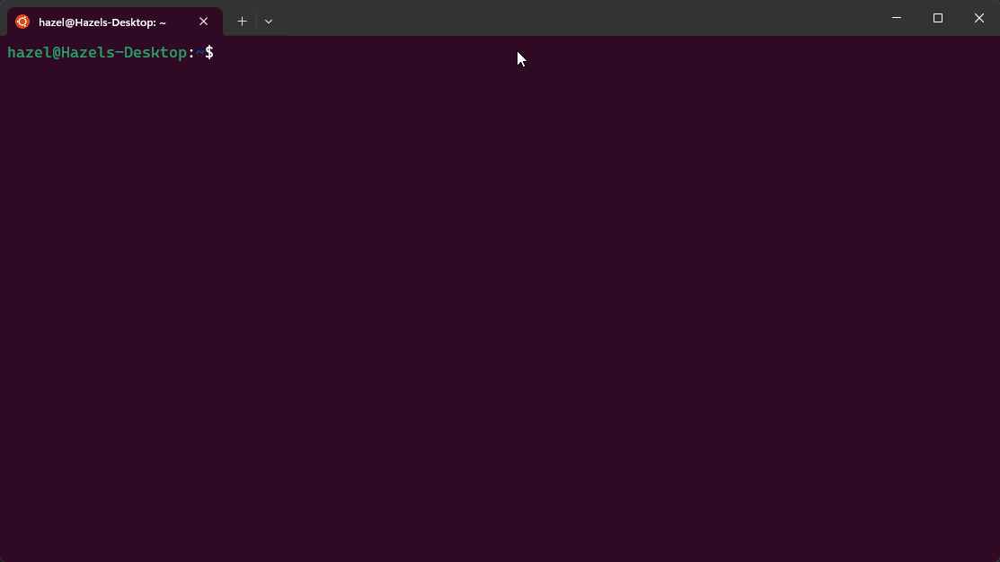
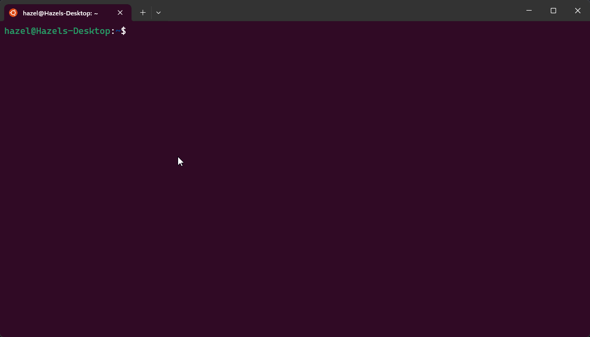

<picture>
  <source media="(prefers-color-scheme: dark)" srcset="https://raw.githubusercontent.com/RustFetch/RustFetch/main/images/rustfetch_full_dark_mode.png">
  <source media="(prefers-color-scheme: light)" srcset="https://raw.githubusercontent.com/RustFetch/RustFetch/main/images/rustfetch_full.png">
  
</picture>

Welcome to RustFetch, a high-performance fetcher for all platforms.

## Installation
You can [download](https://github.com/RustFetch/RustFetch/releases) RustFetch from releases, or compile from source if you would prefer to do so.

## About RustFetch
RustFetch aims to be a full alternative to the popular fetcher NeoFetch, while being cross-platform for Windows, Linux, and MacOS. To achieve this we are remaking NeoFetch in Rust, which provides a major upgrade to performance at runtime. In benchmarks, RustFetch achieves 0m0.007s. While NeoFetch achieves 0m1.768s, which is a major upgrade. 

With RustFetch, we plan to have performance, customisation, and the community at heart. And are always looking for new contributors. If you believe you can introduce some new features, or even add some new ASCII art, feel free to open a PR and follow the guidelines [here](./public/guidelines.md)

## Features
Currently, we have a limited set of features for RustFetch, but we have some large goals in mind to bring the features that people are looking for, and anything the community may be looking for in specific.
  <ul>
    <li>ASCII Images</li>
    <li>Getting the current user and host</li>
    <li>OS and kernel information</li>
    <li>Uptime</li>
    <li>Command Line Arguments</li>
    <li>The current shell</li>
    <li>CPU (+ Multi-CPU)</li>
    <li>Used and total RAM</li>
    <li>Terminal color display</li>
  </ul>

## Customisation

To customize the behavior of RustFetch, you can use command line arguments. Here are some of the available options:

- `--hide-cpu`: Hides the CPU information in the output.
- `--hide-memory`: Hides the RAM information in the output.
- `--hide-uptime`: Hides the uptime in the output.
- `--hide-os`: Hides the OS information in the output.
- `--hide-host`: Hides the host in the output.
- `--hide-kernel`: Hides the kernel information in the output.
- `--hide-shell`: Hides the shell in the output.

You can use these arguments individually or in combination to tailor the output according to your preferences.

Here's an example of how to use the `--hide-cpu` argument:

```bash
$ rust_fetch --hide-cpu
```

By using this argument, the CPU information will not be displayed in the output.

## Planned Features
We have a wide range of features that people usually are looking for, and have plans to implement them all and keep it simple!
Some of the features we have planned are the following:
  <ul>
    <li>Package manager information</li>
    <li>Expanding shell information</li>
    <li>Fancier OS text</li>
    <li>GPU information (possibly NPU)</li>
    <li>Showing the current WM/DE</li>
    <li>Full image support</li>
    <li>Customization via CLI arguments and a config file</li>
  </ul>

## Build from source
  First make sure <a href="https://rustup.rs/"><code>rustup</code></a> is installed and updated, we are on the <code>stable</code> toolchain with rustc being on at least 1.79.0:
  ```bash
    $ rustup update
    $ rustup default stable
    $ rustup show
    active toolchain
    ----------------
    stable-(x) (default)
    rustc 1.79.0 (129f3b996 2024-06-10)
  ```

  Navigate to the projects directory.
  For a development build run:
  ```bash
    $ cargo run
  ```

  To build a production ready executable run:
  ```bash
    $ cargo build --release
  ```
  The binary for your operating system *should* be built inside of <code>./target/release/rust_fetch</code>

  
